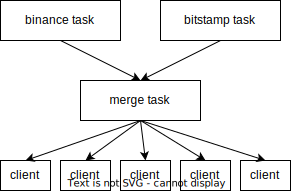

merged-orderbook
===========

Merges order books from Binance and Bitstamp websockets and provides them as a stream over gRPC.

Usage
----------

To start the server, run:

```shell
RUST_LOG=info cargo run --release -- BTCUSDT
```
You can optionally provide an address to listen on, using `--listen`.
For further information, just run it with `--help`.

To start the (very basic) client, run:
```shell
cargo run --release --bin=client
```
If you provided a custom address to the server before, you need to provide it as an argument to the client

Architecture
----------

The general architecture of the server can be summarized using the following diagram:



The arrows in the diagram represent watch channels that handle the communication between the tasks:

When starting the server, the two exchange tasks are spawned, handing each the sender half of a watch channel. The merge task is then spawned with the receiver halves, and the sender half of another watch channel. The receiver half of that third channel is passed to the gRPC service and cloned for every client that connects.